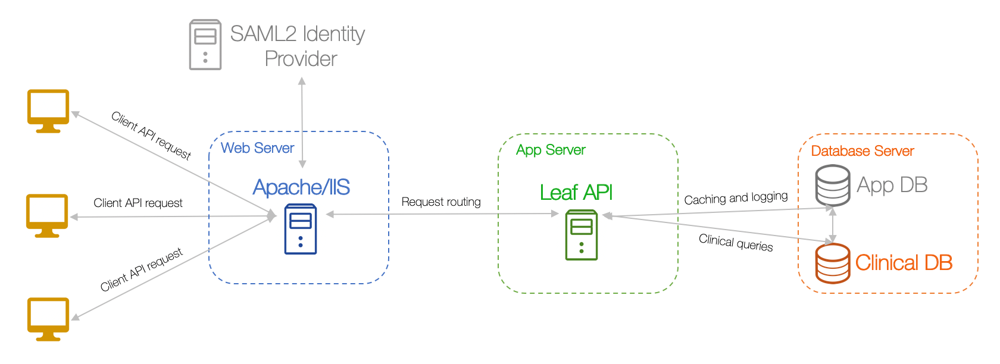
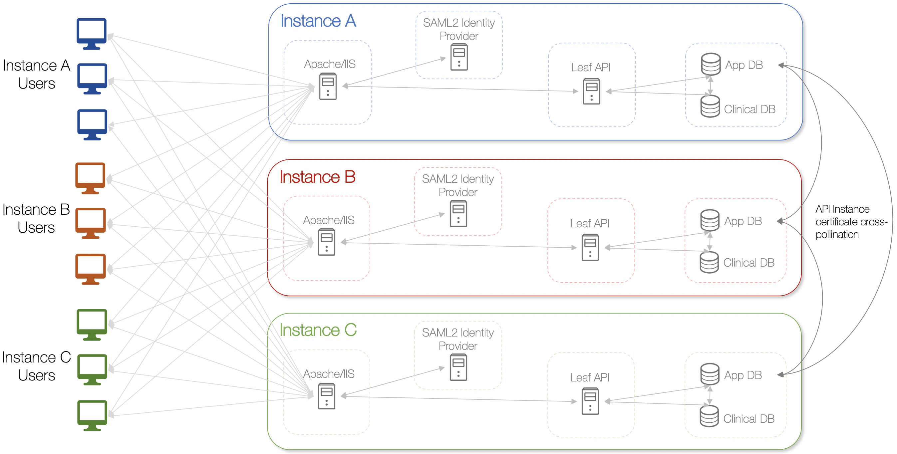

# Deploying Leaf
Welcome! This page serves as a living document for deploying Leaf to your environment. For suggestions, comments, or questions you think we should address, please feel free to open an issue.

## Architecture
Leaf is designed to be deployed in a standard <a href="https://en.wikipedia.org/wiki/Multitier_architecture" target="_blank">three-tier architecture</a>. These tiers are:

1. **Web Server**, with
    - <a href="https://en.wikipedia.org/wiki/Apache_HTTP_Server" target="_blank">Apache</a> or <a href="https://www.iis.net/overview" target="_blank">IIS</a> installed to handle <a href="https://en.wikipedia.org/wiki/HTTPS" target="_blank">https</a> routing for requests from the <a href="https://github.com/uwrit/leaf/tree/master/src/ui-client" target="_blank">client app</a>. These can be configured to work with a <a href="https://en.wikipedia.org/wiki/SAML_2.0" target="_blank">SAML2</a> Identity Provider to manage user authentication and authorization, such as <a href="https://www.shibboleth.net/index/" target="_blank">Shibboleth</a> or <a href="https://docs.microsoft.com/en-us/windows-server/identity/active-directory-federation-services" target="_blank">ADFS</a>.

2. **Application Server**, with
    - <a href="https://dotnet.microsoft.com/download" target="_blank">.NET Core Runtime</a> installed.
    - Note that this *can* be the same server as the web server, though ideally they should be separate depending on hardware, relative load, and number of users.

3. **Database Server**, with
    - The clinical database you'd like to point Leaf at deployed in <a href="https://www.microsoft.com/en-us/sql-server/default.aspx" target="_blank">MS SQL Server</a> (2014+).
    - <a href="https://github.com/uwrit/leaf/blob/master/src/db/build/LeafDB.sql" target="_blank">Leaf application database</a>. Note that this *must* be the same server the clinical database ↑ is deployed to.
    - <a href="https://www.nlm.nih.gov/research/umls/" target="_blank">UMLS database</a> (optional). This can be used to script out creation of Leaf Concepts related to diagnoses, procedures, etc. See examples at <a href="https://github.com/uwrit/leaf-scripts" target="_blank">https://github.com/uwrit/leaf-scripts</a>. Note that you <a href="https://www.nlm.nih.gov/databases/umls.html" target="_blank">must agree to and maintain a current UMLS license</a> for this step.

 

> If you'd like to develop or experiment with Leaf on your local computer (with no users but yourself), you can of course clone the repo and run a Leaf dev instance locally without the above setup.

## Installation Steps

1. Web Server
    - [Setting up Apache](web/apache) or [IIS](web/iis)
    - [Building and deploying the client application](web/client)

2. Application Server
    - [Creating a JWT Signing Key](app/#creating-a-jwt-signing-key)
    - [Setting Environment Variables](app/#setting-environment-variables)
    - [Configuring the appsettings.json file](app/#configuring-the-appsettingsjson-file)

3. Database server
    - [Installing the Leaf application database](db/#installing-the-leaf-application-database)

## Configuring Leaf for your Data
1. [Creating Concepts](../admin/concept)
2. [Defining the Basic Demographics Dataset](../admin/dataset/#basic-demographics)
3. [Setting the Instance Name, Description, and Colors](db/#defining-the-instance-name-description-and-colorset)
4. [Adding New Datasets](../admin/dataset/#adding-new-datasets)

## Networking Multiple Leaf instances
One powerful feature of Leaf is the ability to federate user queries to multiple Leaf instances, even those using different data models. This enables institutions to securely compare patient populations in a de-identified fashion. An example of this functionality can be found at <a href="https://www.youtube.com/watch?v=ZuKKC7B8mHI" target="_blank">https://www.youtube.com/watch?v=ZuKKC7B8mHI</a>. 

> Networking with other Leaf instances is **completely optional**. Deploying locally and querying only your institution's data is perfectly fine.

[Learn how to network multiple Leaf instances](fed/)

