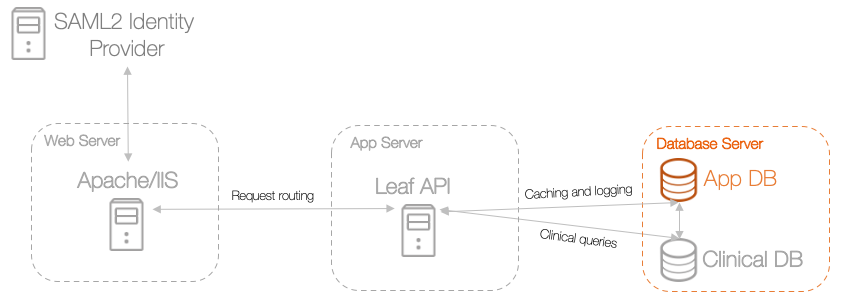

# 1 - Create App Database

 

1. Create a database to serve as the Leaf application database. Note that this **must be the same server that contains your clinical database** you intend to query. This can be as simple as:

    ```sql
    CREATE DATABASE LeafDB 
    ```

    !!! info
        Details on why the databases need to be on the same server can be found on the [FAQs and Troubleshooting page](../../../faqs_and_troubleshooting/installation_questions/#why-do-the-app-and-clinical-databases-need-to-be-on-the-same-server)

    !!! tip
        We recommend also **creating a Leaf-specific service account and password** for the API to use later, though this isn't a requirement.

2. Populate the database `tables`, `stored procedures`, and `functions` using the <a href="https://github.com/uwrit/leaf/blob/master/src/db/build/LeafDB.Schema.sql" target="_blank">LeafDB.Schema.sql</a> script.

3. Populate the initialization data using the <a href="https://github.com/uwrit/leaf/blob/master/src/db/build/LeafDB.Init.sql" target="_blank">LeafDB.Init.sql</a> script.

4. Populate the <a href="https://www.cms.gov/Medicare/Coding/ICD10/2018-ICD-10-CM-and-GEMs.html" target="_blank">CMS General Equivalence Mapping (GEMs)</a> data using the <a href="https://github.com/uwrit/leaf-scripts/blob/master/GEMs/LeafDB.GEMs.sql" target="_blank">LeafDB.GEMs.sql</a> script. These allow the Concept search box to suggest ICD10 -> ICD9 or ICD9 -> ICD10 equivalents if users search for a specific ICD10/9 code.

<br>
Next: [Step 2 - Configure App Server](../2_app_server)