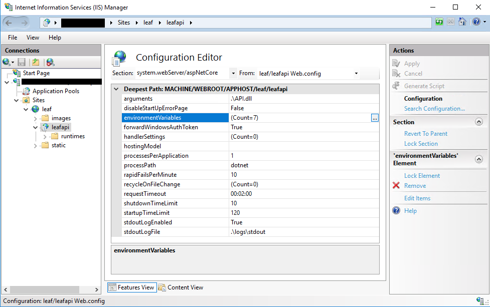

# 3 - Set Environment Variables
Leaf uses environment variables to store sensitive information, such as connection strings, which are loaded when the API is launched. Regardless of the OS and configuration, as a best practice we recommend using environment variables specific to the user account running the Leaf API (rather than global environment variables)

**Leaf environment variables with example values**:

```bash
# Required
LEAF_JWT_CERT   = /var/opt/leafapi/.keys/cert.pem
LEAF_JWT_KEY    = /var/opt/leafapi/.keys/leaf.pfx
LEAF_JWT_KEY_PW = <your_pass>
LEAF_APP_DB     = <leaf_app_db_connection_string>
LEAF_CLIN_DB    = <clinical_db_connection_string>
SERILOG_DIR     = /var/log/leaf/

# Optional
LEAF_REDCAP_SUPERTOKEN = <your_token>     # Only if using REDCap import/export
LEAF_SMTP_USR          = <smtp_user>      # Only if auto-generating help emails
LEAF_SMTP_PW           = <smtp_password>  # Only if auto-generating help emails
ASPNETCORE_URLS = http://0.0.0.0:5001     # Only if using Linux
```

Note that the `LEAF_APP_DB` and `LEAF_CLIN_DB` environment variables are connection strings of the form:
```
Server=<server>;Database=<dbname>;uid=sa;Password=<dbpassword>;
```

## Linux
If using Linux, we recommend:

1. Using full paths when referencing locations on the filesystem.
2. Storing environment variables in a `.conf` file.


## Windows 
If you are using Windows, we assume that you are using IIS.

In IIS environment variables are typically defined as configuration items in your backing application in IIS itself:




As IIS deployment is handled in [Step 6b - Configure IIS with Leaf](../6b_configure_iis), you can wait to set environment variables until IIS configuration is complete.

<br>
Next: [Step 4 - Compile and Deploy the Leaf API](../4_compile)