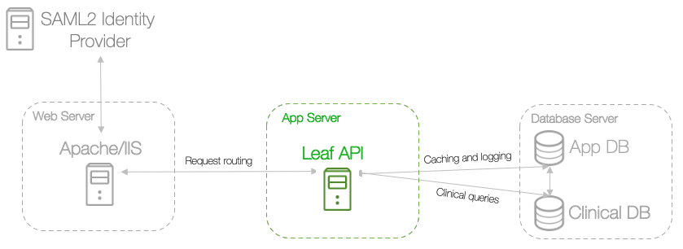

# 5 - Build the Leaf Client

 

The Leaf client application is written in <a href="https://reactjs.org/" target="_blank">React</a> and <a href="https://www.typescriptlang.org/" target="_blank">TypeScript</a> using <a href="https://www.npmjs.com/" target="_blank">Node Package Manager (NPM)</a> and <a href="https://github.com/facebook/create-react-app" target="_blank">Create React App</a>, a bootstrapping library maintained by Facebook. 

Like the Leaf API, Leaf Client as available on GitHub is not yet built for production.

As an alternative to compiling the client yourself, you may also download the latest pre-built Leaf client from the [Leaf Releases page on GitHub](https://github.com/uwrit/leaf/releases). If you download the pre-built version, you can skip ahead to [6 - Configure the appsettings file](../6_appsettings).

In case you're wondering why we're building the Leaf client on the ***app*** server (rather than the ***web*** server), it's because we've downloaded the Leaf source code on the app server, so for now that's where we'll start. Later, if using a separate web server, we'll copy the production client build code to the web server.

1. **Install dependencies**

        $ cd /var/opt/leaf/leaf_download/leaf/
        $ cd src/ui-client/
        $ npm install

2. **Build the client**

    Next we need to build, which transpiles TypeScript and <a href="https://reactjs.org/docs/introducing-jsx.html" target="_blank">TSX/JSX</a> to JavaScript, minifies the code, and outputs a bundle which we can point Apache or IIS to. To build, execute:

        $ npm run build

    This outputs a build bundle to a new `src/ui-client/build/` folder.

3. **Deploy build artifacts**

    The final step is to copy the `/build` folder contents to a directory on the web server that Apache/IIS can serve to users. As we haven't configured Apache or IIS at this point, however, for now just take note of the location of the `/build` folder. 

    For more information on building and deploying React apps, see the <a href="https://facebook.github.io/create-react-app/docs/deployment" target="_blank">Create React App deployment page</a>.

## Wrapping up

At this point, your Leaf directory on the app server should look similar to this:

```
var
├── opt
│   ├── leafapi
│   │   ├── keys                           # JWT signing key
│   │   ├── api                            # Compiled API
│   │   ├── leaf_download                  # Downloaded source files 
|   |   |   ├── leaf 
|   |   |   |   ├── src 
|   |   |   |   |   ├── ui-client 
|   |   |   |   |   |   ├── build          # Built Client
|   |   |   |   |   |   |   ├── static     #########################
|   |   |   |   |   |   |   ├── images     # 
|   |   |   |   |   |   |   ├── index.html # Production Client files
|   |   |   |   |   |   |   ├── manifest   #
|   |   |   |   |   |   |   ├── ...        #########################
├── log 
│   ├── leaf                               # Log files
```

<br>
Next: [6 - Configure the appsettings file](../6_appsettings)
