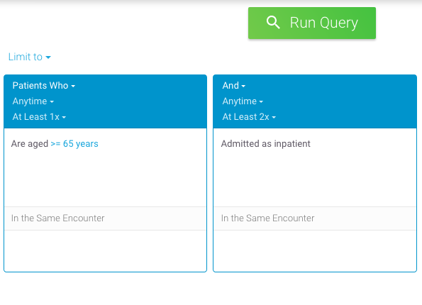
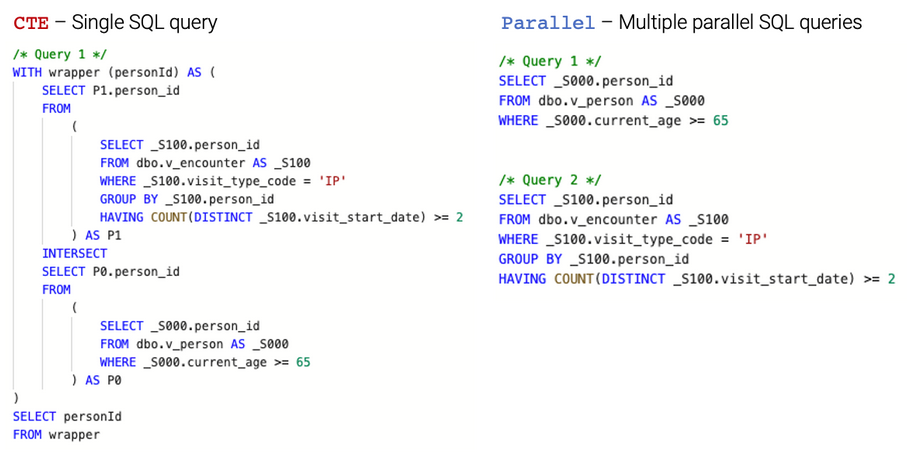
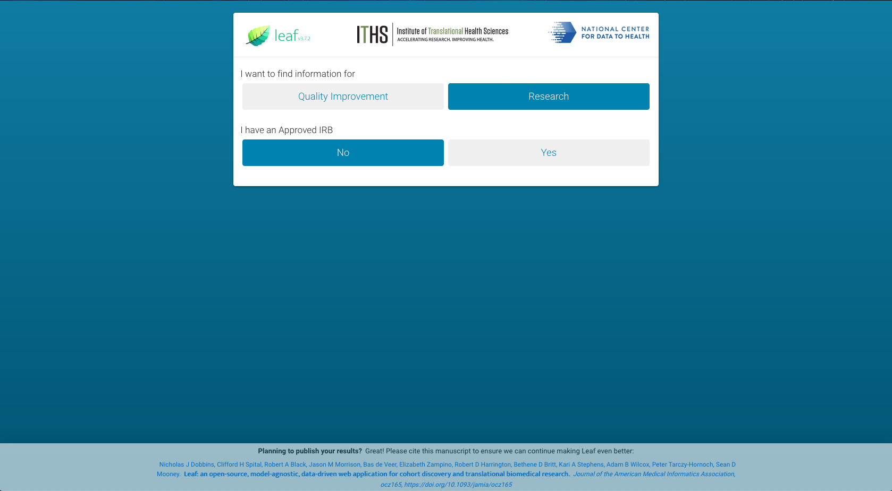
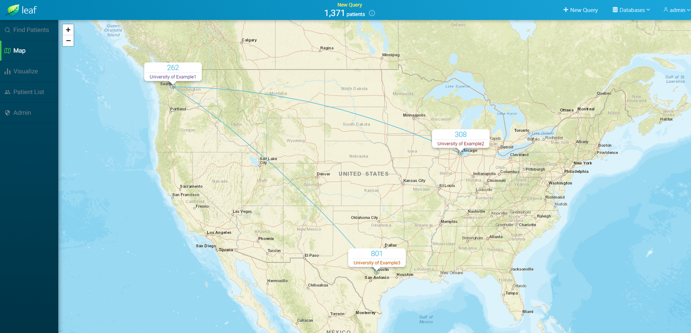
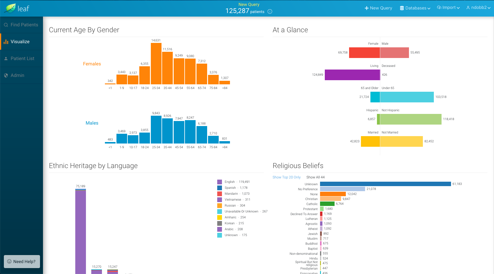
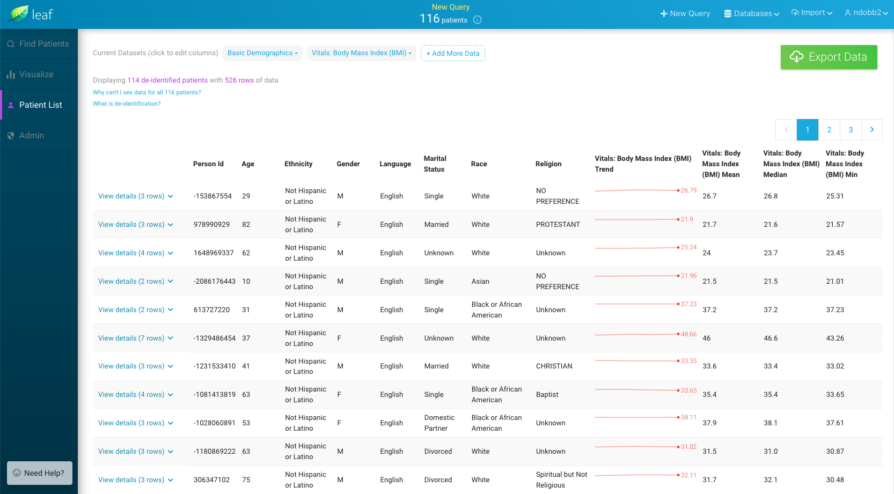

# 6 - Configure the appsettings file

 

The <a href="https://github.com/uwrit/leaf/blob/master/src/server/API/appsettings.json" target="_blank">appsettings.json file</a> acts as the central configuration file for your Leaf instance. When the API is run, it begins by reading the `appsettings.json` file within the compiled API.dll directory to determine how to authenticate users, how to display the Leaf user interface, how to compile SQL statements, and more. 

In the Leaf source code this file can be found under [src/server/API/](https://github.com/uwrit/leaf/tree/master/src/server/API) relative to the Leaf git repository root directory. 

As we already [compiled the API in Step 4](../4_compile_api), though, it can now be found and further customized at the top level of the API.dll directory.

**On the app server, edit the `/var/opt/leafapi/api/appsettings.json` file to suit your usage needs** based on the parameters described below.

---

## Runtime
- **Mode**: `FULL | GATEWAY` - `FULL` mode is used in the vast majority of standard Leaf deployments. Use `GATEWAY` only in cases where this Leaf instance serves to query other federated Leaf instances, and has no clinical data of its own. 

## Jwt
- **SigningKey**: `LEAF_JWT_KEY` - Name of the JWT signing key environment variable.
- **Password**: `LEAF_JWT_KEY_PW` - Name of the JWT signing key **password** environment variable. 
- **Certificate**: `LEAF_JWT_CERT` - Name of the environment variable which points to the `pem` file. 
- **Issuer**: Fully-qualified unique name for this Leaf instance (which *issues* authorized JWT tokens to users). This should match the `/CN=` valueused in [Step 3 - Create a JWT Signing Key](../3_jwt). We recomended using a pattern such as `urn:leaf:issuer:leaf.<your_institution>.edu`.

## Db
- **App**
    - **Connection**: `LEAF_APP_DB` - Name of the Leaf app database connection string environment variable.
    - **DefaultTimeout**: Number of seconds allowed before a Leaf app database query times out.
- **Clin**
    - **Connection**: `LEAF_CLIN_DB` - Name of the Leaf app database connection string environment variable.
    - **DefaultTimeout**: Number of seconds allowed before a clinical database query times out.
    - **Cohort**: 
        - **QueryStrategy**: `CTE | PARALLEL` - `CTE` queries wrap individual Leaf panel SQL within a single larger CTE query, and leverage the SQL engine to find the intersect. `PARALLEL` queries are performed concurrently by the Leaf API, which then map/reduces the results to find the intersect.

            Given the following example query:
            

            Leaf would generate SQL similar to (formatted for readability):

            

            In general, we recommend using `CTE`, though if you are finding that one particularly expensive panel's query slows down or times out the entire CTE query, `PARALLEL` may be a good option.

        - **MaxParallelThreads**: Maximum number of allowed concurrent queries to execute if the `PARALLEL` `QueryStrategy`. Defaults to `5` if this value is absent.

## Authentication
- **Mechanism**: `SAML2 | UNSECURED` - Only `SAML2` is currently supported for production. Use `UNSECURED` for development.
- **SessionTimeoutMinutes**: Number of minutes allowed before a session expires. We recommend aligning this value with the timeout configuration other Service Provider used (e.g., Shibboleth).
- **InactivityTimeoutMinutes**: Number of minutes allowed before a lack of user logs a user out of Leaf.
- **LogoutURI**: The URI/URL Leaf will redirect to in the browser upon user logout. For Shibboleth, this is typically of the form `https:<your_leaf_url>.edu/Shibboleth.sso/Logout?return=<Shibboleth_specific_logout_URL>`
- **SAML2**
    - **Headers**
        - **ScopedIdentity**: The SAML2 **Attribute name** which identifies a given user.

## Authorization
- **Mechanism**: `SAML2 | UNSECURED` - Only `SAML2` is currently supported for production. Use `UNSECURED` for development.
- **SAML2**
    - **HeadersMapping**
        - **Entitlements**
            - **Name**: The SAML2 `Attribute name` which identifies groups the user is in.
            - **Delimiter**: The delimeter character which separates group names under **Entitlements.Name**. This is typically `;`.
    - **RoleMapping**
        - **User**: User group from `Entitlements.Name` which the user must be a member of to be a Leaf **user**. 
        - **Super**: User group from `Entitlements.Name` which the user must be a member of to be a Leaf **super user**. *Please note that this role is only a placeholder, and does not currently confer any additional functionality.*
        - **Identified**: User group from `Entitlements.Name` which the user must be a member of to **see identified health information**. 
        - **Admin**: User group from `Entitlements.Name` which the user must be a member of to be a Leaf **administrator**. 
        - **Federated**: User group from `Entitlements.Name` which the user must be a member of to be able to **query other federated Leaf instances** (if configured).

## Attestation
- **Enabled** - `true | false` - Value which indicates whether the login attestation screen should be shown in the user interface. 
    
## Compiler

Example configurations:

**`OMOP`**
```json
"Alias": "@",
"FieldPersonId": "person_id",
"FieldEncounterId": "visit_occurrence_id",
```

**`i2b2`**
```json
"Alias": "@",
"FieldPersonId": "PATIENT_NUM",
"FieldEncounterId": "ENCOUNTER_NUM",
```

- **Alias**: `@` - Unique character which Leaf will replace with a SQL Set alias when compiling SQL queries.
- **FieldPersonId**: SQL field that must be present on every SQL object Leaf will query which uniquely identifies patients in the clinical database.This is usually a value such as `person_id`, `PATIENT_NUM`, `PAT_ID`, etc.
- **FieldEncounterId**: SQL field that must be present on every SQL object Leaf will query which has a one-to-many relationship to patients, such thatpatients can have many over time. This field uniquely identifies for encounters, and is usually a value such as `visit_occurrence_id`,`ENCOUNTER_NUM`, or `EncounterId`.

## Cohort
- **RowLimit**: Maximum allowed number of unique patients which Leaf will cache for a given query. If a user's query exceeds this number, Leaf will not generate Visualization or Patient List screen data.
- **ExportLimit**: Maximum allowed number of unique patients which Leaf will export to REDCap.

## Export
- **REDCap**
    - **Enabled**: `true | false` - Value which indicates REDCap export is enabled.
    - **ApiURI**: URI for the REDCap instance you wish to export to. This should be of the form: `https://<your_redcap_instance>.org/api/`
    - **BatchSize**: Number of rows per batch which Leaf will use to export data to REDCap. We recommend `10`.
    - **RowLimit**: Maximum number of rows of data which Leaf will export to REDCap.
    - **Scope**: Scoped value to add to the end of a user name when granting them ownership of a new REDCap project. 
    
        For example, if user `james007` is using Leaf and the `Scope` is `mi6.uk.gov`, Leaf will set the project owner as `james007@mi6.uk.gov`.

    - **IncludeScopeInUsername**: By default, when Leaf concludes a REDCap export, it gives REDCap a project owner of the form:
        `<current_leaf_username>` + `@` + `<scope_defined_above>`
        To use only `<current_leaf_username>` as the username, set this value to `false`. 
    - **SuperToken**: `LEAF_REDCAP_SUPERTOKEN` - Name of the REDCap Super Token environment variable.
    
- **CSV**
    - **Enabled**: `true | false` - Value which indicates whether CSV export is enabled.

## Import
- **REDCap**
    - **Enabled**: `true | false` - Value which indicates REDCap import is enabled.
    - **ApiURI**: URI for the REDCap instance you wish to import from. This should be of the form: `https://<your_redcap_instance>.org/api/`
    - **BatchSize**: Number of rows per batch which Leaf will use to import into the Leaf app database from REDCap. We recommend `1000`.

## Deidentification
- **Patient**
    - **Enabled**: `true | false` - Value which indicates whether patient-level de-identification is enabled.
    - **Dateshifting**
        - **Increment**: `MINUTE | HOUR | DAY` - Value which indicates the temporal unit by which to shift patient time values.
        - **LowerBound**: Numeric value which indicates the **minimum** number of `Increment` which Leaf should randomly shift a date (eg `-365`).
        - **UpperBound**: Numeric value which indicates the **maximum** number of `Increment` which Leaf should randomly shift a date (eg `200`).
- **Cohort**
    - **Enabled**: `true | false` - Value which indicates whether cohort-level de-identification is enabled.
    - **Noise**: 

        

        - **Enabled**: `true | false` - Value which indicates whether "Noise" should be randomly added to user queries to obfuscate true cohort counts.
        - **LowerBound**: Numeric value which indicates the **minimum** number of patients which Leaf should randomly shift a cohort count.
        - **UpperBound**: Numeric value which indicates the **maximum** number of patients which Leaf should randomly shift a cohort count.

    - **LowCellMasking**:
    
        

        - **Enabled**: `true | false` - Value which indicates whether cohort counts below a `Threshold` should be masked to make the true value unclear to the user.
        - **Threshold**: Numeric value *at or below* which the true cohort count will not be shown to the user.

## Client
- **Map**
    - **Enabled**: `true | false` - Value which indicates whether the Map screen should be shown in the user interface. 
    
    - **TileURI**: URI for the tile layer from which to request dynamic images and generate maps for, such as `https://{s}.tile.openstreetmap.org/{z}/{x}/{y}.png`. Leaf uses [Leaflet.js](https://leafletjs.com/) and [React-Leaflet](https://react-leaflet.js.org/) for map generation. A list of Leaflet tile layer providers can be found at [https://leaflet-extras.github.io/leaflet-providers/preview/](https://leaflet-extras.github.io/leaflet-providers/preview/).
- **Visualize**
    - **Enabled**: `true | false` - Value which indicates whether the Visualize screen should be shown in the user interface. 
    
    - **ShowFederated**: `true | false` - Value which indicates whether the Visualize results for federated Leaf instances should be shown in the user interface. If `false`, only aggregate results from all Leaf instance will be shown.
- **PatientList**
    - **Enabled**: `true | false` - Value which indicates whether the Patient screen should be shown in the user interface. 
    
- **Help**
    - **Enabled**: `true | false` - Value which indicates whether the Help box should be shown in the lower left of the user interface. 
    
    - **Email**: An email address to direct users to, suc has `<your_support_email>.edu`. If blank, "Contact a Leaf administrator" will not be shown.
    - **URI**: A URI/URL to direct users to, such as `https://<your_support_page>`. If blank, "Learn more here" will not be shown.

## Notification
- **Enabled**: `true | false` - Value which indicates whether notification to administrators by email is enabled.
- **Email**
    - **Server**: SMTP server address from which to send emails from, such as `my.server.edu`.
    - **UseSSL**: `true | false` - Value which indicates whether SSL should be used for sending emails.
    - **Sender**
        - **Address**: Email address auto-generated emails to administrators should be sent **from**.
    - **Receiver**
        - **Address**: Email address auto-generated emails should be sent **to**, such as an admin list-serv.
    - **Credentials**
        - **Username**: `LEAF_SMTP_USR` - Name of the SMTP user name environment variable.
        - **Password**: `LEAF_SMTP_PW` - Name of the SMTP user **password** environment variable.

---

<br>
Next: [Step 7 - Set Environment Variables](../7_env)