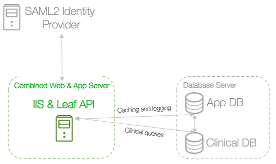

# 8b - Configure Leaf with IIS

 

The following IIS guide assumes you are using a combined web & app single server to both host the Leaf API and handle user traffic.

**On the web/app server**:

1. Install the [.NET Core Hosting Bundle](https://docs.microsoft.com/en-us/aspnet/core/host-and-deploy/iis/?view=aspnetcore-2.2)
2. Install [IIS URL Rewrite](https://www.iis.net/downloads/microsoft/url-rewrite)
3. Install [Shibboleth Service Provider 3](https://wiki.shibboleth.net/confluence/display/SP3/Install+on+Windows#InstallonWindows-Installation)

    !!! info "Be sure to check `Configure IIS7 Module` box during installation."

4. Create an Application pool to run the site and API.
    <p align="center"></p>

6. Create a service account for IIS to run the application as. 
    <p align="center"></p>

    !!! info 
        In this walkthrough we use `sv_uw_leaf_service` but use whatever naming convention is appropriate for your environment

7. Add **Write** permissions for the service account to your logging directory (where the [SERILOG_DIR](../7_env) environment variable is pointing to; this example uses `F:\leaf`)
    <p align="center"></p>

    !!! warning
        This step is critical, as **if IIS is unable to write log activity, you'll also be unable to understand errors or other issues the API encounters**!

5. In the new Application Pool's `Advanced Settings`, set 
    - `Identity` to the service account created in (6) 
    - `Load User Profile` to `True`
    <p align="center"></p>

6. Create the website to host the Leaf browser application.
    <p align="center"></p>

7. Create an application behind the site to host the API.
    <p align="center"></p>

    !!! warning "Do NOT name the API application `'api'`, as this will cause the rewrite rule to apply recursively until the request fails. At UW we name the backing application `'leafapi'`"

8. In the `Configuration Editor`, under `Section`: `system.webServer/aspNetCore` set
    - `arguments` -> `.\API.dll`
    - `processPath` -> `dotnet`

    <p align="center"></p>
   
9. Create a URL rewrite rule on the site with the following template.
    <p align="center"></p>


    !!! warning "Be sure the `Append query string` box is checked. If not, API calls for Concept search will fail"

    Your **`web.config`** should now look like this:

    ```xml
    <system.webServer>
        ...
        <rewrite>
            <rules>
                <rule name="add {applicationName}">
                    <match url="^(api/.*)" />
                    <action type="Rewrite" url="{applicationName}/{R:0}" appendQueryString="true" logRewrittenUrl="true" />
                </rule>
            </rules>
        </rewrite>
    </system.webServer>
    ```

10. If the WebDAV module is installed in your IIS instance, you need to either uninstall it or disable it for this site. It inteferes with PUT/DELETE HTTP verbs.

    ```xml
    <system.webServer>
        ...
        <modules runAllManagedModulesForAllRequests="true">
            <remove name="WebDAVModule" />
        </modules>
    </system.webServer>
    ```

11. If you have not yet created the environment variables for IIS (as described in [Step 7 - Set Environment Variables](../7_env)), do so now.

---

!!! warning
    Before moving on, we **strongly recommend** checking that the Leaf API starts appropriately and can log correctly. **If you skip ahead and check the Leaf client and get an error, the error may simply be symptomatic of the API not running.** To check the API, start the `Application Pool`, then:

    **Confirm that you can see an output log file in your `SERILOG_DIR` directory** - If so, the first line should read something like `{"Timestamp":"...", "Level":"Information","MessageTemplate":"Starting Leaf's API v{Version}..."`

    **If no log files appear**:

    1. Make absolutely sure your service account is running in IIS and has permissions to write to the `SERILOG_DIR` directory.
    2. Check the Windows Event Viewer application for possible errors:
    <p align="center"></p>

    **If log files appear but show an error such as `SqlException...`**

    1. Check that the values in your [LEAF_APP_DB](../7_env) environment variable connection string are correct, such as username and password. 
    2. Check that your service account has [appropriate privileges to your app database](../1_app_db).


<br>
Next: [Step 9 - Configure Authentication with SAML2](../9_saml2)